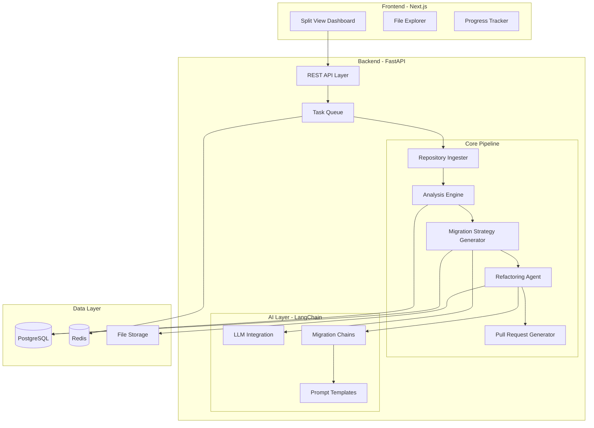

# Design Document

## Overview

CodeArchaeologist is a web-based tool that automates the analysis and modernization of legacy code repositories. The system follows a pipeline architecture where repositories flow through distinct stages: ingestion, analysis, strategy generation, refactoring, and pull request creation. The frontend provides an interactive Split View Dashboard built with Next.js, while the backend leverages Python/FastAPI for deep code analysis and LangChain for intelligent migration logic.

The architecture emphasizes separation of concerns with clear boundaries between the web interface, analysis engine, and refactoring components. This design enables independent scaling of compute-intensive analysis tasks while maintaining a responsive user experience.

## Architecture

### High-Level Architecture



### Technology Stack

**Frontend:**
- Next.js 14 (App Router)
- React 18
- TypeScript
- TailwindCSS for styling
- Monaco Editor for code display
- React Query for state management

**Backend:**
- Python 3.11+
- FastAPI for REST API
- LangChain for LLM orchestration
- Celery for task queue management
- Redis for caching and queue backend

**Analysis Tools:**
- tree-sitter for parsing
- semgrep for pattern matching
- dependency-cruiser for dependency analysis
- lizard for complexity metrics

**Data Storage:**
- PostgreSQL for structured data
- Redis for caching and sessions
- S3-compatible storage for repository files

**AI/LLM:**
- OpenAI GPT-4 or Anthropic Claude
- LangChain for prompt engineering and chains
- Custom prompts for migration strategies

## Components and Interfaces

### 1. Repository Ingester

**Responsibility:** Clone and validate repositories from provided URLs.

**Interface:**
```python
class RepositoryIngester:
    async def ingest_repository(self, url: str, user_id: str) -> LegacyRepo:
        """Clone repository and create initial metadata"""
        pass
    
    async def validate_url(self, url: str) -> bool:
        """Validate repository URL accessibility"""
        pass
    
    async def extract_metadata(self, repo_path: str) -> dict:
        """Extract basic repository metadata"""
        pass
```

### 2. Analysis Engine

**Responsibility:** Identify technology stack, dependencies, and code patterns.

**Interface:**
```python
class AnalysisEngine:
    async def analyze_repository(self, repo: LegacyRepo) -> AnalysisResult:
        """Perform comprehensive repository analysis"""
        pass
    
    async def identify_languages(self, repo_path: str) -> List[LanguageInfo]:
        """Detect programming languages and their usage"""
        pass
    
    async def build_dependency_graph(self, repo_path: str) -> DependencyGraph:
        """Construct dependency relationships"""
        pass
    
    async def detect_frameworks(self, repo_path: str) -> List[Framework]:
        """Identify frameworks and their versions"""
        pass
    
    async def analyze_code_quality(self, repo_path: str) -> QualityMetrics:
        """Calculate complexity, duplication, and quality metrics"""
        pass
```

### 3. Migration Strategy Generator

**Responsibility:** Generate actionable migration plans using LLM reasoning.

**Interface:**
```python
class MigrationStrategyGenerator:
    def __init__(self, llm_chain: LangChain):
        self.llm_chain = llm_chain
    
    async def generate_strategy(self, analysis: AnalysisResult) -> MigrationPlan:
        """Generate comprehensive migration strategy"""
        pass
    
    async def prioritize_steps(self, dependencies: DependencyGraph) -> List[MigrationStep]:
        """Order migration steps by priority and dependencies"""
        pass
    
    async def identify_risks(self, analysis: AnalysisResult) -> List[Risk]:
        """Identify potential migration risks"""
        pass
    
    async def recommend_alternatives(self, outdated_deps: List[Dependency]) -> List[Recommendation]:
        """Suggest modern alternatives for outdated dependencies"""
        pass
```

### 4. Refactoring Agent

**Responsibility:** Apply code transformations based on migration plan.

**Interface:**
```python
class RefactoringAgent:
    def __init__(self, llm_chain: LangChain):
        self.llm_chain = llm_chain
    
    async def refactor_repository(self, repo: LegacyRepo, plan: MigrationPlan) -> RefactoredRepo:
        """Apply all refactoring transformations"""
        pass
    
    async def apply_transformation(self, file_path: str, transformation: Transformation) -> str:
        """Apply single transformation to a file"""
        pass
    
    async def validate_refactoring(self, original: str, refactored: str) -> ValidationResult:
        """Verify refactored code maintains behavior"""
        pass
    
    async def generate_diff(self, original: str, refactored: str) -> Diff:
        """Create detailed diff between versions"""
        pass
```

### 5. Pull Request Generator

**Responsibility:** Create pull requests with refactored code.

**Interface:**
```python
class PullRequestGenerator:
    async def create_pull_request(self, repo: LegacyRepo, refactored: RefactoredRepo, plan: MigrationPlan) -> PullRequest:
        """Generate and submit pull request"""
        pass
    
    async def generate_description(self, plan: MigrationPlan, changes: List[Change]) -> str:
        """Create detailed PR description"""
        pass
    
    async def create_branch(self, repo_path: str, branch_name: str) -> str:
        """Create new branch for changes"""
        pass
```

### 6. REST API Layer

**Endpoints:**
```
POST   /api/repositories              # Submit repository URL
GET    /api/repositories/:id          # Get repository details
GET    /api/repositories/:id/analysis # Get analysis results
GET    /api/repositories/:id/plan     # Get migration plan
POST   /api/repositories/:id/refactor # Trigger refactoring
GET    /api/repositories/:id/diff     # Get code differences
POST   /api/repositories/:id/pr       # Create pull request
GET    /api/repositories              # List all repositories
GET    /api/queue/status              # Get queue status
```

## Data Models

### LegacyRepo Schema

```typescript
interface LegacyRepo {
  id: string;
  url: string;
  name: string;
  owner: string;
  userId: string;
  clonedAt: Date;
  status: 'cloning' | 'analyzing' | 'planning' | 'refactoring' | 'complete' | 'failed';
  metadata: {
    defaultBranch: string;
    lastCommit: Date;
    stars: number;
    size: number;
  };
  storagePath: string;
  createdAt: Date;
  updatedAt: Date;
}
```

### MigrationPlan Schema

```typescript
interface MigrationPlan {
  id: string;
  repoId: string;
  steps: MigrationStep[];
  risks: Risk[];
  estimatedEffort: 'low' | 'medium' | 'high';
  generatedAt: Date;
  summary: string;
}

interface MigrationStep {
  id: string;
  order: number;
  title: string;
  description: string;
  type: 'dependency_update' | 'code_refactor' | 'config_change' | 'breaking_change';
  priority: 'critical' | 'high' | 'medium' | 'low';
  estimatedEffort: string;
  dependencies: string[]; // IDs of steps that must complete first
  recommendations: Recommendation[];
}

interface Risk {
  severity: 'high' | 'medium' | 'low';
  description: string;
  mitigation: string;
}

interface Recommendation {
  from: string; // Old dependency/pattern
  to: string;   // New dependency/pattern
  reason: string;
  breakingChanges: string[];
}
```

### DependencyGraph Schema

```typescript
interface DependencyGraph {
  id: string;
  repoId: string;
  nodes: DependencyNode[];
  edges: DependencyEdge[];
  metadata: {
    totalDependencies: number;
    outdatedCount: number;
    vulnerableCount: number;
  };
}

interface DependencyNode {
  id: string;
  name: string;
  version: string;
  type: 'direct' | 'transitive';
  ecosystem: 'npm' | 'pip' | 'maven' | 'other';
  isOutdated: boolean;
  latestVersion?: string;
  hasVulnerabilities: boolean;
  vulnerabilities?: Vulnerability[];
}

interface DependencyEdge {
  from: string; // Node ID
  to: string;   // Node ID
  type: 'requires' | 'imports' | 'extends';
}

interface Vulnerability {
  id: string;
  severity: 'critical' | 'high' | 'medium' | 'low';
  description: string;
  fixedIn?: string;
}
```

### AnalysisResult Schema

```typescript
interface AnalysisResult {
  id: string;
  repoId: string;
  languages: LanguageInfo[];
  frameworks: Framework[];
  dependencyGraph: DependencyGraph;
  qualityMetrics: QualityMetrics;
  patterns: CodePattern[];
  analyzedAt: Date;
}

interface LanguageInfo {
  name: string;
  percentage: number;
  fileCount: number;
  lineCount: number;
}

interface Framework {
  name: string;
  version: string;
  isOutdated: boolean;
  latestVersion?: string;
  confidence: number; // 0-1
}

interface QualityMetrics {
  complexity: number;
  duplication: number;
  testCoverage?: number;
  maintainabilityIndex: number;
}

interface CodePattern {
  type: string;
  description: string;
  occurrences: number;
  modernAlternative?: string;
}
```

### RefactoredRepo Schema

```typescript
interface RefactoredRepo {
  id: string;
  repoId: string;
  planId: string;
  changes: FileChange[];
  summary: RefactoringSummary;
  branchName: string;
  refactoredAt: Date;
}

interface FileChange {
  path: string;
  originalContent: string;
  refactoredContent: string;
  diff: string;
  transformations: string[];
}

interface RefactoringSummary {
  filesChanged: number;
  linesAdded: number;
  linesRemoved: number;
  transformationsApplied: number;
  flaggedForReview: string[];
}
```

## Correctness Properties

*A property is a characteristic or behavior that should hold true across all valid executions of a system—essentially, a formal statement about what the system should do. Properties serve as the bridge between human-readable specifications and machine-verifiable correctness guarantees.*


### Property Reflection

After reviewing all identified properties, several can be consolidated to reduce redundancy:

- Properties 1.1, 1.3, and 1.4 all relate to the repository ingestion flow and can be combined into a comprehensive ingestion property
- Properties 2.1, 2.2, and 2.3 all relate to analysis completeness and can be unified
- Properties 5.2, 5.3, and 5.4 all relate to Split View behavior and can be combined
- Properties 7.1, 7.2, and 7.5 all relate to progress tracking and can be unified
- Properties 8.1, 8.2, and 8.4 all relate to data persistence round-tripping

The consolidated properties below provide unique validation value without logical redundancy.

### Core Properties

**Property 1: Repository ingestion completeness**
*For any* valid repository URL, when submitted to the system, the repository should be cloned, analysis should be initiated, and the repository metadata should be retrievable from storage with all required fields populated.
**Validates: Requirements 1.1, 1.3, 1.4**

**Property 2: Invalid input rejection**
*For any* invalid or malformed repository URL, the system should reject the submission with a clear error message and prevent any processing stages from executing.
**Validates: Requirements 1.2**

**Property 3: Analysis completeness**
*For any* analyzed repository, the analysis results should include language identification with percentages summing to 100%, all dependencies extracted from package manager files, and a complete dependency graph with nodes for all discovered dependencies.
**Validates: Requirements 2.1, 2.2, 2.3**

**Property 4: Framework conflict detection**
*For any* repository with multiple versions of the same framework, the system should flag version conflicts and identify a primary framework version.
**Validates: Requirements 2.4**

**Property 5: Unknown technology logging**
*For any* unrecognized technology encountered during analysis, the system should log it as an unknown item available for manual review.
**Validates: Requirements 2.5**

**Property 6: Migration plan generation**
*For any* completed analysis, a migration plan should be generated with at least one prioritized step, and every step should have an effort estimate assigned.
**Validates: Requirements 3.1, 3.3**

**Property 7: Breaking change identification**
*For any* migration plan involving dependency version upgrades, breaking changes and compatibility risks should be identified and documented.
**Validates: Requirements 3.2**

**Property 8: Outdated dependency recommendations**
*For any* outdated dependency identified in the analysis, the migration plan should include a specific recommendation for a modern alternative with justification.
**Validates: Requirements 3.4**

**Property 9: Vulnerability prioritization**
*For any* migration plan where security vulnerabilities are detected, the steps addressing those vulnerabilities should have higher priority values than non-security steps.
**Validates: Requirements 3.5**

**Property 10: Transformation application**
*For any* file processed by the refactoring agent, all transformations specified in the migration plan for that file should be applied to the output.
**Validates: Requirements 4.1**

**Property 11: Refactoring summary generation**
*For any* completed refactoring operation, a summary should be generated containing the count of files changed, lines added, lines removed, and transformations applied.
**Validates: Requirements 4.3**

**Property 12: Ambiguous pattern flagging**
*For any* code pattern that the refactoring agent cannot confidently transform, the pattern should be flagged for manual review rather than transformed.
**Validates: Requirements 4.4**

**Property 13: Split view synchronization**
*For any* scroll event in either panel of the split view, both panels should scroll to maintain the same relative position, and any differences between versions should be highlighted.
**Validates: Requirements 5.2, 5.3**

**Property 14: File loading completeness**
*For any* file selected from the file tree, both the legacy and modernized versions should be loaded and displayed, or if no modernized version exists, only the legacy version should display with an indicator.
**Validates: Requirements 5.4, 5.5**

**Property 15: Pull request completeness**
*For any* generated pull request, it should include a detailed description of all changes, links to the migration plan and analysis results, and be configured to target the default branch.
**Validates: Requirements 6.2, 6.3, 6.4**

**Property 16: Branch creation**
*For any* user approval of modernization, a new branch should be created containing all refactored code files.
**Validates: Requirements 6.1**

**Property 17: Pull request failure recovery**
*For any* failed pull request generation, the system should provide the user with an option to download the changes as a patch file.
**Validates: Requirements 6.5**

**Property 18: Progress tracking consistency**
*For any* processing stage transition, the progress indicator should update with the current stage name, completion percentage, and estimated time remaining, with updates occurring at least every 10 seconds during long-running operations.
**Validates: Requirements 7.1, 7.2, 7.4**

**Property 19: Error recovery options**
*For any* error occurring during processing, the system should display error details and provide options to retry or skip the failed stage.
**Validates: Requirements 7.3**

**Property 20: Data persistence round-trip**
*For any* completed analysis and generated migration plan, storing and then retrieving the data should return all original information including the LegacyRepo metadata, MigrationPlan steps, and DependencyGraph structure.
**Validates: Requirements 8.1, 8.2, 8.4**

**Property 21: Repository listing completeness**
*For any* user, when they access the dashboard, all previously analyzed repositories associated with their user ID should be displayed with current status.
**Validates: Requirements 8.3**

**Property 22: Data integrity validation**
*For any* data retrieved from storage, the system should validate integrity and handle corrupted records gracefully without crashing.
**Validates: Requirements 8.5**

**Property 23: Queue ordering**
*For any* set of concurrent analysis requests, they should be queued and processed in order, with each request receiving a queue position and estimated wait time.
**Validates: Requirements 9.1, 9.2**

**Property 24: Concurrent analysis limiting**
*For any* system state, the number of simultaneously running analyses should never exceed the configured maximum concurrent limit.
**Validates: Requirements 9.3**

**Property 25: Queue progression**
*For any* completed analysis, if the queue is not empty, the next queued request should begin processing immediately.
**Validates: Requirements 9.4**

**Property 26: Queue cancellation**
*For any* user cancellation of a queued analysis, the item should be removed from the queue and all remaining queue positions should be recalculated.
**Validates: Requirements 9.5**

**Property 27: Language-specific analysis**
*For any* repository containing JavaScript, TypeScript, or Python code, the analysis should identify the language version, package manager dependencies, and framework usage specific to that language.
**Validates: Requirements 10.1, 10.2**

**Property 28: Polyglot repository handling**
*For any* repository containing multiple programming languages, each language should be analyzed independently and the results should be combined into a single unified migration plan.
**Validates: Requirements 10.3**

**Property 29: Partial analysis support**
*For any* repository containing unsupported languages, the system should notify the user and provide complete analysis for all supported language portions.
**Validates: Requirements 10.4**

**Property 30: Framework-aware refactoring**
*For any* detected framework in the analysis, the refactoring agent should apply framework-specific transformation strategies appropriate to that framework.
**Validates: Requirements 10.5**

## Error Handling

### Error Categories

**1. Input Validation Errors**
- Invalid repository URLs
- Inaccessible repositories (private, deleted, network issues)
- Unsupported repository formats

**Strategy:** Validate early at the API layer, return clear error messages with suggested fixes, log for monitoring.

**2. Analysis Errors**
- Parsing failures for malformed code
- Unrecognized file formats
- Incomplete dependency information

**Strategy:** Continue analysis with partial results, flag problematic files, provide warnings rather than failing completely.

**3. LLM/AI Errors**
- API rate limits
- Token limit exceeded
- Model unavailability
- Hallucinated or invalid suggestions

**Strategy:** Implement retry logic with exponential backoff, chunk large inputs, validate LLM outputs against schemas, provide fallback to rule-based approaches.

**4. Refactoring Errors**
- Syntax errors in generated code
- Breaking transformations
- File system errors

**Strategy:** Validate refactored code syntax before saving, flag ambiguous transformations for manual review, maintain rollback capability.

**5. External Service Errors**
- Git operations failures
- GitHub API errors
- Database connection issues

**Strategy:** Implement circuit breakers, retry with backoff, provide graceful degradation, cache when possible.

### Error Response Format

```typescript
interface ErrorResponse {
  error: {
    code: string;
    message: string;
    details?: any;
    suggestions?: string[];
    retryable: boolean;
  };
}
```

### Retry Strategy

- Network errors: 3 retries with exponential backoff (1s, 2s, 4s)
- LLM rate limits: Retry after rate limit reset time
- Transient failures: 2 retries with 5s delay
- Non-retryable errors: Fail immediately with clear message

## Testing Strategy

### Unit Testing

**Frontend (Next.js):**
- Component rendering tests using React Testing Library
- User interaction tests for Split View Dashboard
- API client mocking with MSW (Mock Service Worker)
- State management tests for React Query

**Backend (FastAPI):**
- API endpoint tests with TestClient
- Service layer unit tests with mocked dependencies
- Database operation tests with test database
- LangChain chain tests with mocked LLM responses

**Key Unit Test Areas:**
- URL validation logic
- Dependency graph construction
- Migration plan prioritization algorithms
- Diff generation accuracy
- Queue management operations

### Property-Based Testing

We will use **Hypothesis** for Python backend testing and **fast-check** for TypeScript frontend testing.

**Configuration:**
- Minimum 100 iterations per property test
- Custom generators for domain objects (repositories, dependencies, migration plans)
- Shrinking enabled to find minimal failing cases

**Property Test Requirements:**
- Each property-based test MUST be tagged with a comment referencing the correctness property from this design document
- Tag format: `# Feature: code-archaeologist, Property {number}: {property_text}`
- Each correctness property MUST be implemented by a SINGLE property-based test
- Tests should generate random valid inputs and verify the property holds

**Example Property Test Structure:**

```python
from hypothesis import given, strategies as st

# Feature: code-archaeologist, Property 1: Repository ingestion completeness
@given(st.text(min_size=10).filter(is_valid_git_url))
def test_repository_ingestion_completeness(repo_url):
    """For any valid repository URL, ingestion should complete and metadata should be retrievable"""
    result = ingest_repository(repo_url)
    assert result.status == "success"
    
    retrieved = get_repository(result.id)
    assert retrieved is not None
    assert retrieved.url == repo_url
    assert retrieved.metadata is not None
```

**Property Test Coverage:**
- All 30 correctness properties must have corresponding property-based tests
- Focus on properties involving data transformations, persistence, and business logic
- UI properties may use example-based tests where property testing is impractical

### Integration Testing

- End-to-end API tests covering full pipeline: ingest → analyze → plan → refactor → PR
- Database integration tests with real PostgreSQL instance
- Redis queue integration tests
- Git operations integration tests with test repositories

### Test Data Strategy

- Maintain a suite of test repositories covering different scenarios:
  - Small single-language repos
  - Large polyglot repos
  - Repos with outdated dependencies
  - Repos with security vulnerabilities
  - Repos with complex dependency graphs
- Use repository fixtures for consistent testing
- Generate synthetic code samples for edge cases

## UX Flow

### 1. Repository Submission Flow

```
User lands on homepage
  ↓
Enters repository URL in input field
  ↓
Clicks "Analyze Repository" button
  ↓
System validates URL (instant feedback)
  ↓
If valid: Redirect to analysis dashboard
If invalid: Show inline error with suggestions
```

### 2. Analysis Dashboard Flow

```
Analysis dashboard loads
  ↓
Shows progress bar with current stage
  ↓
Real-time updates every 10 seconds
  ↓
Stages: Cloning → Language Detection → Dependency Analysis → Quality Metrics → Strategy Generation
  ↓
On completion: Show summary card with key metrics
  ↓
Enable "View Migration Plan" button
```

### 3. Migration Plan Review Flow

```
User clicks "View Migration Plan"
  ↓
Display migration plan with:
  - Summary of changes
  - Prioritized steps with effort estimates
  - Identified risks with severity
  - Dependency recommendations
  ↓
User reviews plan
  ↓
User clicks "Start Refactoring" button
  ↓
Confirmation modal: "This will create refactored code. Continue?"
  ↓
If confirmed: Trigger refactoring process
```

### 4. Split View Dashboard Flow

```
Refactoring completes
  ↓
Redirect to Split View Dashboard
  ↓
Left panel: Legacy code (read-only)
Right panel: Modernized code (read-only)
  ↓
File tree on left sidebar showing all changed files
  ↓
User selects file from tree
  ↓
Both panels load and display the file
  ↓
Differences highlighted with color coding:
  - Red: Removed lines
  - Green: Added lines
  - Yellow: Modified lines
  ↓
Synchronized scrolling between panels
  ↓
User reviews changes across all files
  ↓
User clicks "Create Pull Request" button
```

### 5. Pull Request Generation Flow

```
User clicks "Create Pull Request"
  ↓
Modal shows PR preview:
  - Title (auto-generated)
  - Description (includes migration plan summary)
  - Target branch
  - Files changed count
  ↓
User can edit title and description
  ↓
User clicks "Submit Pull Request"
  ↓
System creates branch and PR
  ↓
Success: Show PR link and success message
Failure: Show error and "Download Patch" option
```

### 6. Dashboard History Flow

```
User returns to main dashboard
  ↓
Shows list of all previously analyzed repositories
  ↓
Each card shows:
  - Repository name
  - Status badge (analyzing, complete, failed)
  - Last updated timestamp
  - Quick actions (View Plan, View Code, View PR)
  ↓
User clicks on a repository card
  ↓
Loads that repository's analysis and results
```

### UI Components

**Split View Dashboard Layout:**

```
┌─────────────────────────────────────────────────────────────┐
│  CodeArchaeologist                    [User Menu]            │
├───────────┬─────────────────────────┬─────────────────────────┤
│           │  Legacy Code            │  Modernized Code        │
│  File     │  (Read-only)            │  (Read-only)            │
│  Tree     ├─────────────────────────┼─────────────────────────┤
│           │                         │                         │
│  📁 src   │  import React from...   │  import React from...   │
│    📄 App │  class App extends...   │  function App() {       │
│    📄 util│                         │                         │
│  📁 test  │  componentDidMount() {  │  useEffect(() => {      │
│           │    // old code          │    // modernized        │
│           │  }                      │  }, [])                 │
│           │                         │                         │
│  [Create  │                         │                         │
│   PR]     │                         │                         │
└───────────┴─────────────────────────┴─────────────────────────┘
```

**Key UI Features:**
- Syntax highlighting with Monaco Editor
- Line-by-line diff highlighting
- Synchronized scrolling with visual indicator
- Collapsible file tree with change indicators
- Sticky header with repository info
- Responsive design for different screen sizes

## Performance Considerations

### Scalability

**Repository Size Limits:**
- Maximum repository size: 1GB
- Maximum file count: 10,000 files
- Timeout for analysis: 30 minutes

**Concurrent Processing:**
- Maximum concurrent analyses: 5 (configurable)
- Queue size limit: 100 pending requests
- Worker pool for parallel file processing

### Caching Strategy

**Redis Caching:**
- Analysis results: 24 hours TTL
- Dependency graph: 24 hours TTL
- Repository metadata: 7 days TTL
- Queue state: No expiration (persistent)

**CDN Caching:**
- Static assets: 1 year
- API responses: No caching (dynamic)

### Optimization Techniques

**Backend:**
- Lazy loading of large dependency graphs
- Streaming responses for long-running operations
- Database query optimization with indexes
- Connection pooling for database and Redis

**Frontend:**
- Code splitting for Split View Dashboard
- Virtual scrolling for large file lists
- Debounced search and filter operations
- Optimistic UI updates

## Security Considerations

### Authentication & Authorization

- OAuth integration with GitHub for repository access
- JWT tokens for API authentication
- Role-based access control (user, admin)
- Repository access validation before cloning

### Data Protection

- Encrypt sensitive data at rest (database encryption)
- HTTPS only for all communications
- Sanitize repository URLs to prevent injection
- Rate limiting on API endpoints (100 requests/minute per user)

### Code Safety

- Sandbox execution environment for code analysis
- No arbitrary code execution from repositories
- Validate all LLM outputs before applying
- Audit logging for all refactoring operations

### Dependency Security

- Regular security scanning of dependencies
- Automated vulnerability detection in analyzed repos
- Secure storage of GitHub tokens
- Principle of least privilege for service accounts

## Deployment Architecture

### Infrastructure

**Frontend:**
- Vercel or AWS Amplify for Next.js hosting
- CDN for static assets
- Environment-based configuration

**Backend:**
- Docker containers for FastAPI services
- Kubernetes for orchestration
- Horizontal scaling for worker nodes
- Load balancer for API traffic

**Data Layer:**
- Managed PostgreSQL (AWS RDS or similar)
- Managed Redis (AWS ElastiCache or similar)
- S3 for repository storage
- Backup strategy: Daily snapshots, 30-day retention

### Monitoring & Observability

- Application metrics: Prometheus + Grafana
- Error tracking: Sentry
- Logging: Structured logs with ELK stack
- Uptime monitoring: Pingdom or similar
- LLM usage tracking and cost monitoring

### CI/CD Pipeline

- GitHub Actions for automated testing
- Automated deployment on merge to main
- Staging environment for pre-production testing
- Rollback capability for failed deployments
- Database migration automation

## Future Enhancements

1. **Multi-repository batch processing** - Analyze multiple repos simultaneously
2. **Custom migration rules** - Allow users to define custom refactoring patterns
3. **AI-powered code review** - Automated review of refactored code quality
4. **Integration with CI/CD** - Automatic PR creation on schedule
5. **Support for more languages** - Expand beyond JS/TS/Python
6. **Collaborative features** - Team workspaces and shared analyses
7. **Cost estimation** - Estimate cloud cost impact of migrations
8. **Rollback capability** - Undo refactoring if issues arise
9. **A/B testing framework** - Compare different migration strategies
10. **Plugin system** - Allow community-contributed analyzers and refactorers
